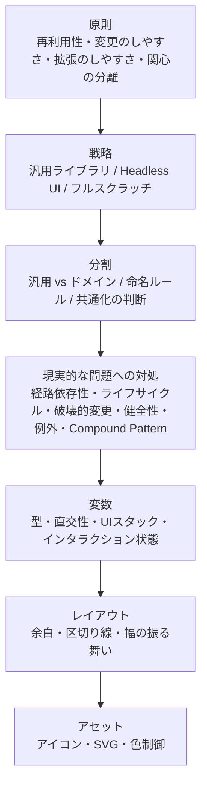

長い記事にお付き合いいただき、ありがとうございます。

コンポーネントは単なるUIの見た目ではなく、チームの共通言語です。 この記事では、デザインシステムのコンポーネント設計を、原則から具体的な変数の型まで段階的に掘り下げてきました。

一貫しているのは、コンポーネントは単なるUIの見た目ではなく、チームの共通言語であるということです。命名ひとつ、変数の型ひとつが、デザインと実装の間の翻訳コストを左右します。

# この記事のキーテイクアウェイ

- 原則と戦略を固める: 再利用性・変更のしやすさ・拡張のしやすさ・関心の分離の4原則を土台に、汎用とドメインの境界を引き、命名ルールを整備する。名前はデザインシステムで最も長く残るものだからこそ、最初からルールを持って臨む
- 型とUI状態を定義しきる: Boolean・Enum・Stringを押さえ、すべてのUI状態（Ideal / Empty / Loading / Partial / Error）をデザインする。プロパティ同士の直交性を保ち、安全な変更と破壊的変更の区別を身につける。コンポーネントは中身に責任を持ち、配置は親に任せる
- AIの精度は設計の精度で決まる: 命名規則・型定義・UI状態の定義が整ったデザインシステムは、AIコード生成の精度を引き上げる。デザイナーが仕組みを理解し、エンジニアと共通言語を持つことの価値は、AI時代にさらに高まる

デザインシステムのコンポーネント設計は、一度読んで完全に理解できるような分野ではありません。実際のプロダクト開発の中で議論し、手を動かし、失敗し、直していく中で少しずつ身についていくものです。

実装とデザインで会話が通じた瞬間や、Figmaのプロパティ設計がそのままコードに反映されたのを見た瞬間——そうした小さな手応えの積み重ねが、視野を広げてくれます。

この記事は、そのときに立ち返れるリファレンスとして使ってもらえればと思っています。全部を一気に取り入れる必要はありません。

いま自分のチームで課題になっている章から読み直してみる、チームの会話で、これ記事に書いてあったなと思い出す。そういった使い方で十分です。

そしていま、AIがコードを書く時代に入りつつあります。命名規則が整い、型が明確で、設計意図が言語化されたデザインシステムは、人間の開発者だけでなくAIにとっても最良のインプットになります。
